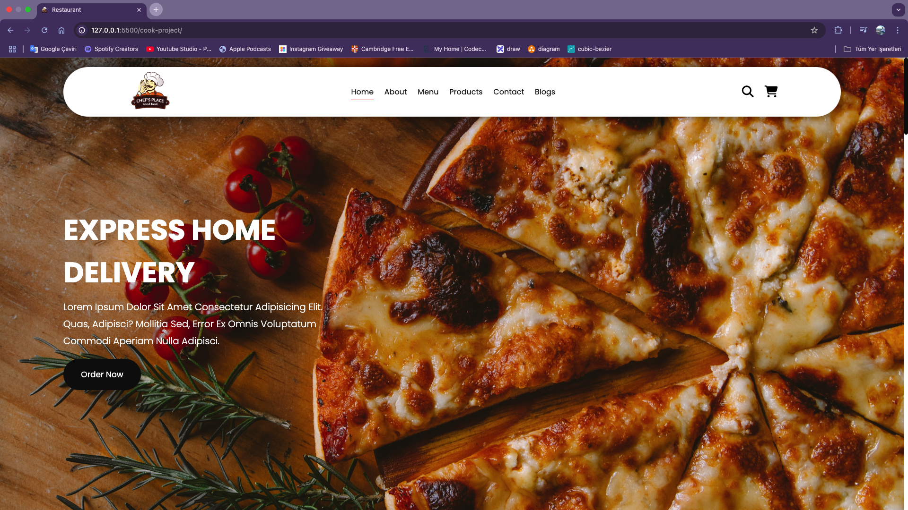
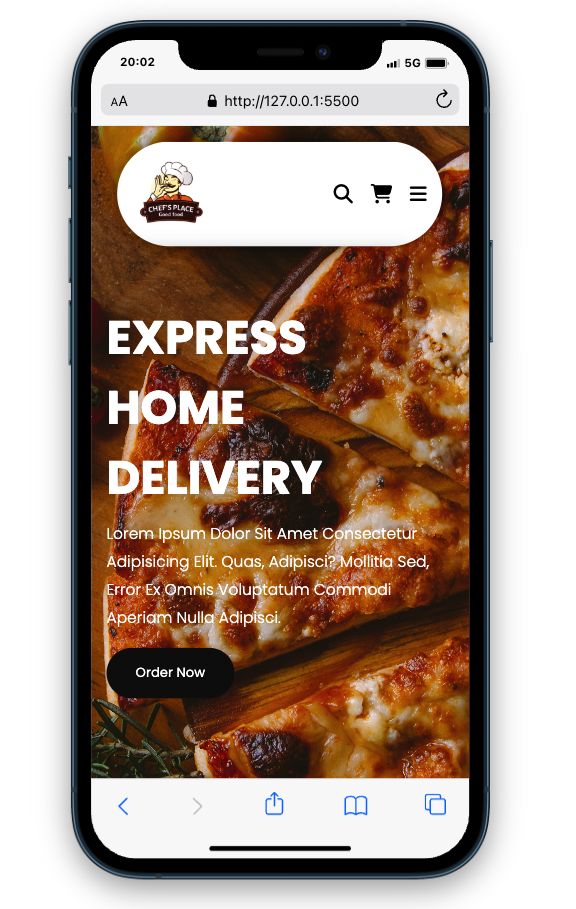

# Cook Shop

Bu proje, yemek tarifleri ve mutfakla ilgili içerikler sunan bir **Cook Shop** projesidir. **HTML, CSS ve JavaScript** kullanılarak oluşturulmuş olup **responsive** tasarıma sahiptir.

## ✨ Özellikler
- **Responsive Tasarım**: Mobil, tablet ve masaüstü cihazlarla uyumludur.
- **Modern UI/UX**: Kullanıcı dostu ve şık bir arayüz.
- **Dinamik İçerik**: JavaScript ile etkileşimli bileşenler.
- **CSS Animasyonları**: Kullanıcı deneyimini artıran görsel efektler.

## 📚 Kullanılan Teknolojiler
- **HTML5**
- **CSS3** (Flexbox & Grid, Animasyonlar)
- **JavaScript (ES6+)**

## ✨ Kurulum
Projeyi çalıştırmak için aşağıdaki adımları takip edebilirsiniz:

1. Bu repoyu klonlayın:
   ```bash
   git clone https://github.com/kullanici-adin/cook-shop.git
   ```
2. Proje klasörüne gidin:
   ```bash
   cd cook-shop
   ```
3. `index.html` dosyasını tarayıcınızda açın.

## 🚀 Ekran Görüntüleri



## 👤 Katkıda Bulunma
Projeye katkıda bulunmak isterseniz, **pull request** açabilirsiniz.

## 🌐 Canlı Önizleme


---
_Bu proje, yalnızca eğitim amaçlı geliştirilmiştir ve ticari bir amacı yoktur._

